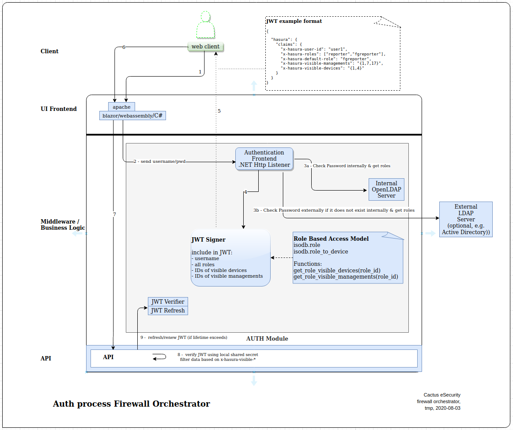

# Authentication and Authorization in Firewall Orchestrator

Users can either be stored in the local LDAP server that comes with the Firewall Orchestrator or you may use one or more external LDAP servers (recommended).


## Implementation
In Firewall Orchestrator all permissions are tied to roles which are enforced solely in the API layer. 
Therefore we can ensure the same access security via API access as whithin the product itself.

Also have a look at
- the [role based access control model](rbac.md)
- how to [define roles & permissions in hasura](https://hasura.io/docs/1.0/graphql/manual/auth/authorization/index.html)
  - For an example see <https://dev.to/lineup-ninja/modelling-teams-and-user-security-with-hasura-204i>
  - see [hasura doc on auth](https://hasura.io/docs/1.0/graphql/manual/auth/authorization/roles-variables.html)



## Roles

The latest and most detailed role based acccess model can always be found in the help pages of Firewall Orchestrator itself.

There is also multi-tenancy support which you can use to implement per-tenant permissions for defined firewall gateways.

See <rbac.md>

## Login limits

Every login with credentials makes the middleware search and bind in the active LDAP connections. To keep
unauthenticated requests from turning into a flood of directory operations, the login endpoints
(`AuthenticationToken/GetTokenPair`, `Get`, `GetTokenPairForUser`, `GetForUser`) are limited as follows:

| Limit | Default | Answer when exceeded |
|---|---|---|
| Credentialed login attempts per client address and minute | 30 | `429` with `A0006` and `Retry-After` |
| Failed logins per user name and client address and minute | 10 | `429` with `A0006` and `Retry-After` |
| Active LDAP connections one login may be tried against | 16 | `503` with `A0007` (logged as error) |
| Logins waiting for LDAP at the same time | 32 | `429` with `A0006` |
| LDAP operations running at the same time (all logins) | 4 | queued until a slot is free |
| Time for all directory work of one login | 10 s | `503` with `A0007` |

Anonymous token requests (no user name or password) cause no LDAP work and are never limited. A cancelled HTTP
request cancels its outstanding directory work. Token refreshes are not rate limited, as they require a valid
refresh token, but share the deadline; a refresh that runs out of time answers `503` without consuming the token.

The client address is the one the local Apache reverse proxy appends to `X-Forwarded-For`. Addresses of the
middleware host itself and the UI hosts are exempt from the per-client limit, because every login through the UI
arrives from the UI server's address. The per-user failure limit still applies to them, so repeated wrong
passwords for one user through the UI block further attempts for that user from the UI for up to a minute.
This includes service accounts such as `importer` when they log in from the same host as the UI.

The limits can be changed in `/etc/fworch/fworch.json`; the middleware reads them at startup:

```json
{
  "login_max_directories": 16,
  "login_client_attempts_per_minute": 30,
  "login_user_failures_per_minute": 10,
  "login_trusted_client_hosts": ["ui-srv", "192.168.121.2"]
}
```

`login_trusted_client_hosts` is written by the installer from the `frontends` inventory group (inventory names
and `ansible_host` values). It is refreshed on every upgrade, so set the inventory variable
`login_trusted_client_hosts` instead of editing the file if you need other hosts. Host names that cannot be
resolved at startup are logged as a warning and not exempt.
